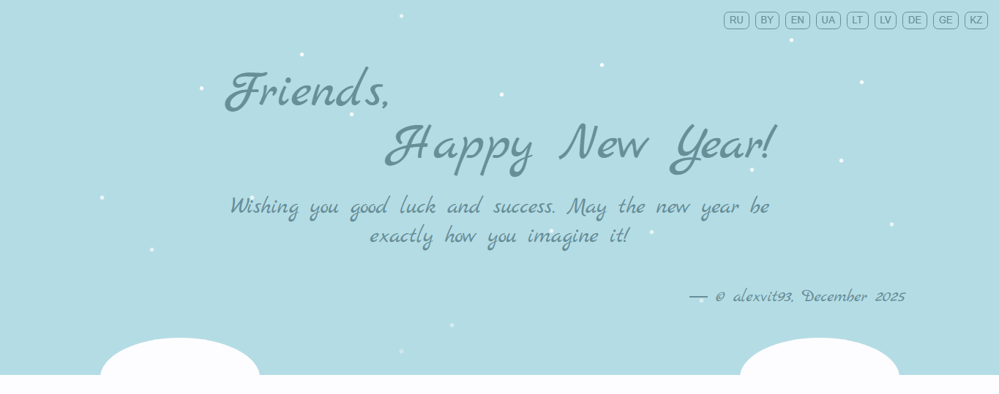

# 🎅 Multilingual New Year's Postcard

An interactive festive postcard with support for 10 languages and automatic user language detection.

## ✨ Features

- 🌐 **9 Languages**: Russian, Belarusian, English, German, Ukrainian, Lithuanian, Latvian, Georgian, Kazakh
- 🎯 **Auto-language detection**: By IP address, browser settings, or URL parameters
- ❄️ **Animated snowfall**: 38 snowflakes with unique trajectories
- 📱 **Responsive design**: Properly displays on all devices
- 🎨 **Festive theme**: Snowdrifts, smooth animations
- 🔄 **Language switching**: Intuitive buttons with state preservation

## 🚀 Technologies

- HTML5
- CSS3 (CSS Grid, Flexbox, Custom Properties, Animations)
- Vanilla JavaScript (ES6+)
- [Google Fonts](https://fonts.google.com/) (Marck Script)
- [ipapi.co](https://ipapi.co/) API for geolocation

## 📁 Project Structure

```
new-year-card/
├── index.html          # Main HTML file
├── css/
│   └── style.css      # Styles and animations
├── js/
│   └── wishes.js      # Language switching logic
├── img/
│   └── favicon.ico    # Site favicon
└── README.md
```

## 🎨 Preview



## 🌍 Supported Languages

| Language   | Code | Greeting                        |
| ---------- | ---- | ------------------------------- |
| Russian    | `ru` | Друзья, с Новым годом!          |
| Belarusian | `by` | Сябры, Вiншую з Новым годам!    |
| English    | `en` | Friends, Happy New Year!        |
| German     | `de` | Freunde, Frohes neues Jahr!     |
| Ukrainian  | `ua` | Друзі, з Новим роком!           |
| Lithuanian | `lt` | Draugai, Su Naujaisiais metais! |
| Latvian    | `lv` | Draugi, Laimīgu Jauno gadu!     |
| Georgian   | `ka` | მეგობრებო, გილოცავთ ახალ წელს!  |
| Kazakh     | `kz` | Достар, Жаңа жылмен!            |

## ⚙️ Usage

### Quick Start

1. Clone the repository:

```bash
git clone https://github.com/AlexVit93/new_year_ip_postcard.git
```

2. Open `index.html` in your browser

### Language Detection

The system detects language in the following order:

1. **URL parameter**: `?lang=ua`
2. **Saved preference** (localStorage)
3. **User's IP address**
4. **Browser language**
5. **Russian** (default)

### Manual Switching

Click the language code button in the top right corner.

## 🔧 Customization

### Adding a New Language

1. Add translation to `wishes.js`:

```javascript
const translations = {
  es: {
    // Spanish
    friends: "Amigos,",
    newYear: "¡Feliz Año Nuevo!",
    wish: "Les deseo buena suerte y éxito. ¡Que el nuevo año sea exactamente como lo imaginan!",
    author: "© alexvit93, Diciembre 2025",
  },
};
```

2. Add button to `index.html`:

```html
<button data-lang="es">ES</button>
```

3. Add country mapping in `countryToLang`:

```javascript
this.countryToLang = {
  ES: "es", // Spain
  MX: "es", // Mexico
  AR: "es", // Argentina
};
```

### Modifying Animations

All animations are in `style.css`. Customize:

- Snowfall speed: `animation-duration` in `.snow::before`
- Snowflake count: add/remove elements with `.snow` class
- Colors: modify CSS variables in `:root`

## 📱 Responsiveness

- **Mobile** (< 480px): Vertical layout, centered text
- **Tablet** (480px - 1200px): Horizontal greeting layout
- **Desktop** (> 1200px): Enlarged fonts, optimized snowdrifts

## 🐛 Known Issues

- Language detection by IP may be inaccurate with some VPN services
- Some CSS animations may not work in older browsers
- Ad blockers may interfere with geolocation API

## 🤝 Contributing

1. Fork the repository
2. Create a feature branch (`git checkout -b feature/AmazingFeature`)
3. Commit your changes (`git commit -m 'Add AmazingFeature'`)
4. Push to the branch (`git push origin feature/AmazingFeature`)
5. Open a Pull Request

## 📄 License

Distributed under the MIT License. See `LICENSE` for more information.

## 📧 Contact

Alexey - [@alexvit93](https://github.com/AlexVit93)

Project Link: [https://github.com/AlexVit93/new_year_ip_postcard.git](https://github.com/AlexVit93/new_year_ip_postcard.git)

---

_Made with ❤️ for festive mood! 🎄_
